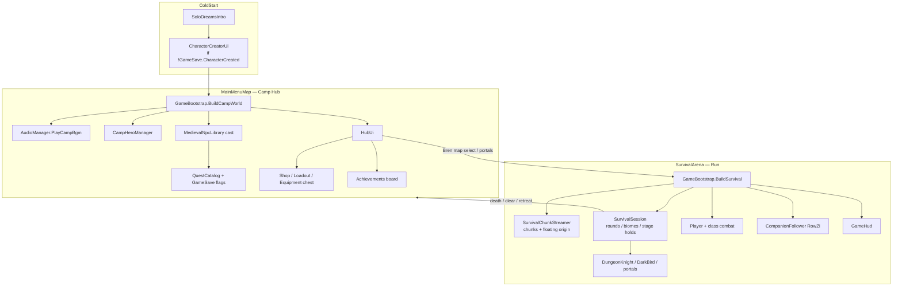
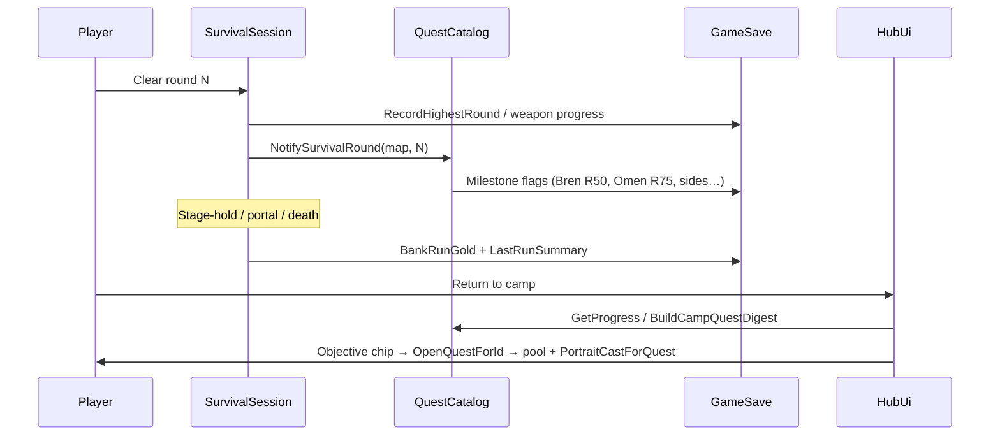
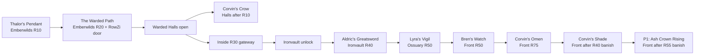
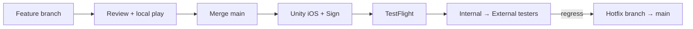

# Project Zx — Full Game Systems Review & Development Roadmap

| Field | Value |
|-------|-------|
| **Author** | Systems Architecture (Draft) |
| **Date** | 2026-08-31 |
| **Status** | Draft (rev 4 — PO decisions locked; next: PR-01) |
| **Repo** | [Emilstrongmanyt/Project-Zx](https://github.com/Emilstrongmanyt/Project-Zx) · branch `main` |
| **Local path** | `C:\MMORPG-Project\mmorpg-mobile\Project Zx` |
| **Ship path** | Push to `main` → `.github/workflows/ios-testflight.yml` → TestFlight (`com.solodreams.ProjectZx`) |
| **Unity** | 6000.5.2f1 (CI) |

---

## Overview

Project Zx is a Unity mobile survival roguelite: a camp hub (`MainMenuMap`) feeds discrete survival runs (`SurvivalArena`) across five lore-named maps (Emberwilds → Warded Halls → Ironvault → Silent Ossuary → The Endless Front). Progression is PlayerPrefs-backed via `GameSave`; content is code-driven (catalogs + runtime UI), not scene-authored content packs.

This document is a **systems audit + multi-quarter roadmap**, not a single-feature design. It maps what ships today, names concrete gaps with severity, summarizes the player/lore arc (including the post–Corvin's Shade narrative cliff), locks a concrete **P1 Quest Contract**, and proposes an actionable phase plan, key decisions, and mergeable PRs for a small team shipping TestFlight from `main`.

**Strategic stance:** reuse-first. Prefer new quests, biomes, bosses, and shop items on existing rails (`QuestCatalog`, `SurvivalSession`, `MedievalNpcLibrary`, `WeaponCatalog`, `EquipmentCatalog`) over greenfield engines. New systems are called out only where current architecture cannot absorb the need.

---

## Background & Motivation

### Current state (verified in code)

- **Two-scene bootstrap:** `GameScenes.MainMenuMap` / `SurvivalArena`; `GameBootstrap` builds camp or survival at runtime (`RuntimeInitializeOnLoadMethod`).
- **Shipped content spine:** full main quest chain through Corvin's Shade; four side quests; class unlocks; weapon material ladder through Fateful (Front R100); equipment chest; RowZi companion; Male/Female HeroEditor creator; DnB/Metal BGM; SoloDreams intro.
- **World tech:** `SurvivalChunkStreamer` (16u chunks, floating origin rebase at 64u, Cainos/pixel prop biomes); Unlimited Front shifts visual biome by round (`GameSessionContext.GetUnlimitedBiome`).
- **CI:** every `main` push builds iOS on Linux (game-ci) and signs/uploads on macOS → TestFlight.

### Pain points

1. **Narrative cliff:** Corvin's Shade turn-in text says "for now" / "when the wind tastes wrong again" with **no next quest id** — Endgame content is Endless Front grind + weapon tiers only.
2. **God-files:** `ArtLibrary.cs` (~2.9k LOC), `HubUi.cs` (~2.8k), `EnemyActor.cs` (~1.6k), `GameSave.cs` (~1.5k) concentrate risk and slow TestFlight iteration.
3. **Persistence model:** ~100 named key constants plus dynamic per-class weapon keys, with `PlayerPrefs.Save()` on nearly every setter (~98 call sites in `GameSave`) — fine for a single-device soft launch, fragile for cloud sync / anti-cheat / multi-profile.
4. **Hygiene debt:** untracked `Assets/Music/` (~160 MB) duplicates tracked `Assets/_Project/Resources/Music/` (runtime loads `Resources.LoadAll("Music/" + genre)`).
5. **Live-ops / meta absent:** no seasons, no remote config, no IAP hooks, no analytics beyond local achievements.

---

## Goals & Non-Goals

### Goals

- Give the team a **shared systems map** and **severity-ranked debt list** grounded in real paths/classes.
- Define a **prioritized roadmap** (P0–P3) executable by a small team on the existing TestFlight cadence.
- Prefer **content beats on existing systems** for the next lore chapter after Shade.
- Produce **Key Decisions**, a locked **P1 Quest Contract**, and an ordered **PR Plan** for near-term work.

### Non-Goals

- Implementing features in this document (audit + plan only).
- Designing full MMO networking / persistent open world (product is hub + arena survival).
- Replacing HeroEditor, Layer Lab UI, or Cainos tile packs wholesale.
- Committing to monetization or PvP without product-owner answers (see Open Questions).

---

## Current-State Systems Map

### Architecture (hub vs survival)



### Major managers & catalogs (cite)

| Concern | Primary types | Path |
|--------|----------------|------|
| Scene wiring | `GameBootstrap`, `GameScenes`, `GameSessionContext` | `Assets/_Project/Scripts/Core/` |
| Persistence | `GameSave` (PlayerPrefs) | `Core/GameSave.cs` (~1498 LOC) |
| Quests | `QuestCatalog`, `QuestId`, Hub dialogue | `Core/QuestCatalog.cs`, `UI/HubUi.cs` |
| Survival loop | `SurvivalSession`, `ChallengeWaveCatalog` | `Waves/` |
| World | `SurvivalChunkStreamer`, `ArenaBounds`, portals/doors | `World/` |
| Combat | `PlayerCombat` + class scripts, `CombatDamage` | `Combat/` |
| Enemies / bosses | `EnemyActor` (incl. fire breath Outside R20 / Inside R30) | `Enemies/EnemyActor.cs` |
| NPCs | `MedievalNpcLibrary` | `World/MedievalNpcLibrary.cs` |
| Audio / art | `AudioManager`, `ArtLibrary` | `Core/` |
| Gear | `EquipmentCatalog`, `WeaponCatalog`, `ShopCosts` | `Core/` |
| Weapon visuals | `HeroEditorWeaponMap` | `HeroEditor/HeroEditorWeaponMap.cs` |
| Talents | `EpicTalentCatalog` (run-scoped bitmask) | `Core/EpicTalentCatalog.cs` |
| Companion | `CompanionFollower`, `GameFactory.CreateCompanion` | `Player/`, `Core/GameFactory.cs` |
| Creator | `CharacterCreatorUi`, `HeroEditorCharacterView` | `UI/`, `HeroEditor/` |
| CI | `ios-testflight.yml` | `.github/workflows/` |

### Survival map ladder

| Enum | Display name | Cap / unlock gate |
|------|--------------|-------------------|
| `Outside` | Emberwilds | Stage hold R20 → door + RowZi → Inside |
| `Inside` | Warded Halls | Stage hold R30 → gateway → Dungeon |
| `Dungeon` | Ironvault | Clear path → Crypt portal |
| `Crypt` | Silent Ossuary | R50 Minotaur → victory gate → Unlimited |
| `Unlimited` | The Endless Front | R1–100 (`StatCaps.UnlimitedMaxRound`); biomes shift 1–20 / 21–50 / 51–100 |

### Data flow (run gold & quests)



---

## Strengths

1. **Coherent content spine on thin rails.** Twelve quests share one `QuestDefinition` + `QuestProgress` machine; HubUi routes chips via `OpenQuestForId` → `QuestCatalog.GetQuestPoolFor` / `GetGiverDisplayName`, with portraits from `PortraitCastForQuest`. New chapters are mostly catalog + flags + one encounter spawn.
2. **Survival world tech is production-grade for mobile.** Chunk streaming + floating origin with stable logical coords (`SurvivalChunkStreamer`) avoids float precision blowups on Endless Front without torus wrap jank.
3. **Class fantasy is real.** Five classes (`Batter`, `Spearman`, `Bowman`, `Magician`, `Samurai`) with dedicated combat scripts; attack modes and shop unlocks gated cleanly via `AttackModeCatalog` / `ShopCosts`.
4. **Long-horizon power fantasy without a new meta layer.** Per-class weapon tiers Wooden→Fateful (`WeaponCatalog`) and permanent shop upgrades with `StatCaps` progression tiers give grind targets past story.
5. **Camp UX polish is ahead of typical soft-launch.** Objective chip → correct NPC, camp quest digest, ready toasts, beginner tip catalog, run results panels, SoloDreams branding.
6. **Companion RowZi** is integrated (HeroEditor fixed look via `GameSave.CreateRowZiAppearanceJson()`, follow + combat + loot vacuum) rather than cosmetic-only.
7. **Ship pipeline is real.** Game-CI Unity iOS → Mac sign → Fastlane Pilot; build number from `GITHUB_RUN_NUMBER`; `workflow_dispatch` sign-only path for recovery.
8. **Lore naming is consistent** across UI (`SurvivalMapNames`), tips, and quest copy (Second War / campfire last free light).

---

## Gaps / Risks / Tech Debt

Severity: **Critical** = ship-blocker or data-loss risk; **Major** = slows content or hurts retention; **Minor** = hygiene / polish.

| ID | Severity | Finding | Evidence | Mitigation |
|----|----------|---------|----------|------------|
| D1 | **Major** | Post-Shade **narrative dead end** — no next `QuestId`, no new map, no villain beat after "something older than the Second War." Retention/content gap (not a ship or data-loss blocker). | `QuestId` max = `CorvinsShade`; Shade completed text is open-ended | P1 Quest Contract (below) |
| D2 | **Major** | `GameSave` key sprawl + `PlayerPrefs.Save()` on almost every setter | ~99 named key constants; ~98 `Save()` sites; plus dynamic per-class weapon keys | Batch saves; consider JSON blob migration later (not P0) |
| D3 | **Major** | God-objects block safe parallel work | `ArtLibrary` ~2899, `HubUi` ~2813, `EnemyActor` ~1572 | Split by domain in P0/P2 PRs (settings first, then shop; boss AI in P2) |
| D4 | **Major** | **~160 MB duplicate** untracked `Assets/Music/` vs `Assets/_Project/Resources/Music/` | `git status` → `?? Assets/Music/`; AudioManager loads Resources only | Delete + `.gitignore` (hygiene PR-01) |
| D5 | **Major** | Boss / fire-breath logic tightly coupled in `EnemyActor` | Fire breath gated Outside R20 / Inside R30 only; R40/R50 scale off Outside R20 constants | Extract in **P2** (PR-09); P1 epilogue must **not** touch `EnemyActor` |
| D6 | **Major** | No remote analytics / crash grouping called out in code | Local `Achievements` only | Add minimal telemetry before live-ops (P3) |
| D7 | **Major** | Altair / Angelic are **not** flag-ready: `IsTierUnlocked` hard-returns `false`; `HeroEditorWeaponMap.PaintForTier` has no Altair/Angelic cases (fallthrough `null`); Admurin pixel assets exist but live equip path incomplete | `WeaponCatalog.cs`, `HeroEditorWeaponMap.cs` | P1 Altair unlock API (below); Angelic deferred |
| D8 | **Minor** | Equipment catalog is small (12 items, 4 slots) | `EquipmentCatalog.All` | Expand via same drop/chest path |
| D9 | **Minor** | Hub camp can feel crowded as cast grows | `GameBootstrap` conditional spawns | Map marker / quest log list before more NPCs |
| D10 | **Minor** | CI hardcodes signing identity string | `ios-testflight.yml` | Document rotation; secret-ize display name if possible |
| D11 | **Major** | Single-device save = wipe on reinstall / no cloud | PlayerPrefs | Accept for soft launch; decide Game Center / iCloud later |
| D12 | **Minor** | `ChallengeWaveCatalog` exists but is secondary to main loop | `Waves/ChallengeWaveCatalog.cs` | Promote in **P2** (not P1 critical path) |

### Risk register

| Risk | Severity | Likelihood | Mitigation |
|------|----------|------------|------------|
| Main push always burns CI + TestFlight slot | Major | High | Feature branches; squash to `main` on cadence; use `sign_only` for resign |
| Content PR conflicts in HubUi/QuestCatalog | Major | High | Complete settings extract before quest HubUi edits; serialize shop split after P1 content |
| Balance cliffs on Front R50–100 | Major | Med | Telemetry + gold/XP knobs in catalogs before new maps |
| Accidental commit of `Assets/Music/` duplicates IPA size / CI disk | **Critical** | Med | `.gitignore` + delete local copy (PR-01) |

---

## Player Journey & Lore Arc

### Main chain (as implemented)



| Quest | Giver | Objective | Gold |
|-------|-------|-----------|------|
| Thalor's Pendant | Thalor | Emberwilds R10 pendant | 800 |
| The Warded Path | Thalor | Emberwilds R20 → RowZi → door | 450 |
| Corvin's Crow | Corvin (after free) | Halls after R10 free crow | 1000 |
| Aldric's Greatsword | Aldric | Ironvault R40 blade | 1000 + Flame Enchant |
| Lyra's Vigil | Lyra | Ossuary R50 Minotaur | 1200 |
| Bren's Watch | Bren | Front R50 | 1500 |
| Corvin's Omen | Corvin | Front R75 | 2000 |
| Corvin's Shade | Corvin | Front after R40 banish shade | 2500 |

### Side quests

| Quest | Unlock | Target |
|-------|--------|--------|
| Kael's Recon | After Pendant | Emberwilds R15 |
| Nessa's Salve | Inside unlocked | Halls R15 |
| Garrick's Anvil | Dungeon unlocked | Ironvault R20 |
| Tove's Chart | Crypt unlocked | Ossuary R25 |

### Parallel systems journey

- **Classes (exact gates):**
  - Batter — default
  - Spearman — Emberwilds R20 boss path (`GameSave.SpearmanUnlocked`)
  - Bowman — **Warded Halls R30** (`SurvivalSession.TryUnlockBowman`)
  - Samurai — **Ironvault R40 boss** clear (`EnemyActor` sets `SamuraiUnlocked` + crypt portal)
  - Magician — **Endless Front R80** (`SurvivalSession.TryUnlockMagician`) — late Front, not midgame
- **Companion:** RowZi at Emberwilds R20 door (`Together Again` achievement).
- **Weapons:** Iron @ Dungeon R30 per class; Steel–Fateful @ Front R20–R100; Gold @ 50k kills; Altair/Angelic enum + Admurin art exist but unlock/visual wiring incomplete (see Altair API).
- **Meta shop:** Mira outfitter — HP/DMG/SPD/Range linear costs; Whirlwind, Piercing Shot, Frost Tip, magnets, Thick Hide, Second Wind, Campfire Blessing, Flame Enchant (Aldric).

### Narrative gaps after Shade

1. **No named villain** after "something older than the Second War" — Shade is a symptom, not a climax.
2. **No sixth map / biome** — Front R100 is a mechanical capstone, not a story beat.
3. **Campfire "last free light" promise** is unresolved; cast has nothing new to say after completed text.
4. **Altair/Angelic** art and unused challenge modes are natural hooks for an Ash Crown chapter **without** a new engine.

### P1 Quest Contract (locked — PO naming & Altair power confirmed)

| Field | Locked choice |
|-------|----------------|
| **Working title / id** | `QuestId.AshCrownRising = 13` (display: **"Ash Crown Rising"** — PO final) |
| **Primary giver** | **Corvin only** — add to `QuestCatalog.CorvinQuestIds`; accept + turn-in at Corvin |
| **Secondary NPC** | **Thalor tip/toast only** — `BeginnerTipCatalog` + optional Shade-complete handoff line in Thalor completed text; **not** in Thalor pool; chip never opens Thalor for this id |
| **Chip / portrait / name** | `GetQuestPoolFor` → `CorvinQuestIds`; `PortraitCastForQuest` → `Cast.Corvin`; `GetGiverDisplayName` → "Corvin" |
| **Unlock predicate** | `GameSave.QuestCorvinsShadeCompleted` |
| **Objective type** | Shade-style tap-banish (`DarkBirdRescue`), **not** round-hold, **not** decade boss |
| **Map / round** | `SurvivalMapKind.Unlimited`, spawn when `round >= 55` and quest `Active` and not yet banished (mirrors `ShouldSpawnFrontShade` at R40; R55 avoids collide with Shade spawn and stays below Omen R75 hold) |
| **Spawn API** | Extend `DarkBirdKind` + `QuestCatalog.ShouldSpawnAshWraith` + `SurvivalSession.TrySpawnDarkBird` — **forbid `EnemyActor` / `BossArtCatalog` edits in P1** |
| **Session-length intent** | Players who already push Front past R50 (Bren) can complete banish in the **same run** after accepting; fresh Front starts expect ~55 rounds — comparable to Bren's Watch, not a second Omen-style R75 grind |
| **Reward — weapon** | **Altair XOR Angelic → Altair only**; Angelic reserved for a later beat |
| **Reward — power** | **Cosmetic-at-Fateful-power (PO final / K11)** — keep `WeaponCatalog.TierIndex(Altair) == (int)Fateful`; **no AOE**; Hub `GetPerkSummary` must match combat (`HasAoeSplash` only when equipped `== Fateful`) |
| **Reward — gold** | **3000g** placeholder |
| **Lore dump** | Turn-in names the **"Ash Crown / Pre-War"** entity (PO final naming) |
| **Out of P1 epilogue** | Any `BossArtCatalog` / decade remaps (P2 only); new RogueBoss art packs; Angelic unlock; dual-giver accept/turn-in |

Pacing note vs existing Front quests: Bren R50 hold → Omen R75 hold → Shade after R40 banish → **Ash Crown after R55 banish**. Two holds + two banishes; no third deep hold in P1.

---

## Proposed Design (Roadmap Execution Model)

### Operating principles

1. **Content on rails** — new `QuestId`, `GameSave` flags, Corvin pool membership, `DarkBirdKind` spawn in `SurvivalSession.TrySpawnDarkBird`.
2. **Split before swell** — any PR that would add >200 LOC to HubUi/ArtLibrary/EnemyActor should extract a helper first; **do not merge half-extracted HubUi moves**.
3. **TestFlight as acceptance** — merge to `main` only when playable and behavior-regression-checked; prefer 1–2 day PR slices.
4. **No greenfield networking / seasons** until P3 and Open Questions resolve.
5. **P1 encounter path is DarkBird-only** — boss extract (PR-09) stays in P2 and must not race epilogue PRs.

### Phase roadmap

#### P0 — Polish & Stability (≈ 2–4 weeks)

**Intent:** Reduce ship risk and friction so every `main` push is trustworthy.

| Work item | Owner hint | Notes |
|-----------|------------|-------|
| Delete + `.gitignore` untracked `Assets/Music/` | Eng | Keep `Assets/_Project/Resources/Music/{DnB,Metal}` only |
| HubUi **complete** settings/BGM extract (behavior-unchanged) | Eng | One finished extract, not a WIP partial |
| Quest regression checklist (manual) for full chain + sides | QA/Dev | Document in PR template |
| Crash/perf pass on Front R60+ chunk streaming | Eng | Profile rebase + pool churn |
| Confirm fire breath only R20 Outside / R30 Inside in TestFlight | QA | Matches `EnemyActor` gate |
| CI: document `sign_only` recovery in README snippet | Eng | Already in workflow |

**Exit criteria:**

- Working tree clean re: Music (deleted or ignored; Resources path verified in-editor).
- **At least one behavior-unchanged HubUi extract merged** (settings/BGM panel) with regression notes; **ban** merging open HubUi moves that leave duplicate/dead call sites.
- Quest checklist exists; no P0 ship/data blockers on TestFlight.

#### P1 — Content (≈ 1 quarter)

**Intent:** Close the post-Shade cliff per the **P1 Quest Contract**; deepen midgame without new engines.

| Work item | Reuse | New system? |
|-----------|-------|-------------|
| **Ash Crown Rising** (Corvin-primary, Front after R55 DarkBird banish) | `QuestCatalog`, `CorvinQuestIds`, `DarkBirdRescue`, `TrySpawnDarkBird` | No |
| **Altair unlock wiring** (see API) | `GameSave`, `WeaponCatalog.IsTierUnlocked` / `GetSelectableTiers` / **`GetPerkSummary`**, `HeroEditorWeaponMap`, Hub loadout cycle | Wiring gap — not a new progression engine |
| 2–3 side quests on existing maps | Same quest machine | No |
| 4–8 equipment pieces | `EquipmentCatalog` + chest roll | No |
| Camp quest log list (optional) if NPC density hurts | Thin HubUi panel **after** PR-02/05 settle | Maybe small UI only |

> **Note:** Decade boss art remaps (`BossArtCatalog` / existing `RogueBossId` packs) are **not** a P1 work item. They sit in **P2** next to PR-09/10 — never combine with PR-05/06.

**Exit criteria:** After Shade turn-in, objective chip points at Corvin for Ash Crown Rising; a Front run that reaches R55 can banish and turn in within one dedicated session (or mid-run if already deep); Altair appears in loadout for all classes when unlocked.

#### P2 — Systems Depth (≈ 1 quarter)

**Intent:** Depth for retention; still mostly catalog-driven.

| Work item | Notes |
|-----------|-------|
| Extract boss ability module from `EnemyActor` (PR-09) | **After** P1 DarkBird epilogue is on `main` |
| Optional decade boss **art remaps** (existing `RogueBossId` only) | Separate PR from epilogue; reuse `BossArtCatalog` rotation — **no new art pack**; never combine with PR-06 |
| Light challenge / weeklies via `ChallengeWaveCatalog` | Hub surface: Bren map board or campfire sub-panel (sketch in PR-10) |
| Companion loadout independence (optional RowZi class) | Extends `CompanionFollower` / `GameSave` hero class map |
| Talent rarity / epic pity | Soft changes to `EpicTalentCatalog.RollChoices` |
| Begin `GameSave` blob migration design | Dual-write PlayerPrefs ↔ JSON; do not cut over mid-season |
| ArtLibrary partials **after** equipment icon consumers land | Serialize behind PR-07 |

**Exit criteria:** Can add a boss ability without editing unrelated enemy chase code; save migration design reviewed; weeklies have an explicit Hub entry.

#### P3 — Live-ops / Meta (≈ quarter+, after PO answers)

**Intent:** Only if soft launch metrics warrant.

| Work item | Depends on PO |
|-----------|----------------|
| Analytics (install → R20 → Front unlock → Shade complete) | Privacy policy |
| Seasonal Front modifier + cosmetic reward | Monetization? |
| IAP / battle pass **or** premium once | Monetization model |
| Cloud save / Game Center | Platform priority |
| Android pipeline parity | Store strategy |
| PvP / async — **default recommendation: no** | See Key Decisions |

**Exit criteria:** Defined live cadence (e.g. biweekly content) with telemetry.

---

## API / Interface Changes

### Quest + DarkBird (P1)

```csharp
// QuestCatalog.cs
public enum QuestId {
    // ... existing through CorvinsShade = 12
    AshCrownRising = 13,
}

// Add to CorvinQuestIds[]; IsUnlocked = () => GameSave.QuestCorvinsShadeCompleted
// Mirror Shade progress: Accepted / Banished / Completed keys on GameSave

// DarkBirdRescue.cs
public enum DarkBirdKind {
    CorvinCrow = 0,
    FrontShade = 1,
    AshWraith = 2,  // P1
}

// QuestCatalog — mirror ShouldSpawnFrontShade
public static bool ShouldSpawnAshWraith(SurvivalMapKind mapKind, int round)
{
    if (mapKind != SurvivalMapKind.Unlimited) return false;
    if (round < 55) return false;
    if (GetProgress(QuestId.AshCrownRising) != QuestProgress.Active) return false;
    return !GameSave.QuestAshCrownBanished;
}

// SurvivalSession.TrySpawnDarkBird — branch for AshWraith (no EnemyActor)
```

### Hub routing (single-giver rule)

- `QuestCatalog.GetQuestPoolFor(AshCrownRising)` → `CorvinQuestIds`
- `HubUi.PortraitCastForQuest` → `MedievalNpcLibrary.Cast.Corvin`
- `QuestCatalog.GetGiverDisplayName` → Corvin
- `OpenCorvinQuestGiver` fallback may prefer `AshCrownRising` when that quest is the open chapter (same pattern as current Shade fallback)
- **Do not** add to `GetThalorQuestIds()`

### Altair unlock API (required wiring — not "flag only")

Today: `WeaponCatalog.IsTierUnlocked` **hard-returns false** for Altair/Angelic; `GetSelectableTiers` therefore omits them; `GameSave.SetEquippedWeaponTier` rejects locked tiers; `HeroEditorWeaponMap.PaintForTier` has no Altair/Angelic arms (falls through to `null`); Admurin Resources names already include `altair` / `angelic` suffixes in `MaterialSuffix` / `GetResourceName`.

**P1 contract:**

| Piece | Change |
|-------|--------|
| `GameSave` | `const string AltairUnlockedKey = "zx_weapon_altair_unlocked"`; `bool AltairUnlocked` (account-wide story flag — all classes gain Altair in `GetSelectableTiers` when true) |
| `WeaponCatalog.IsTierUnlocked` | Remove hard-false for Altair; return `GameSave.AltairUnlocked`. Angelic stays hard-false |
| `GetSelectableTiers` / Hub cycle | No change beyond `IsTierUnlocked` (already drives loadout list at `HubUi` ~1642) |
| `TierIndex` / power | **Keep** Altair clamped to Fateful power (cosmetic-at-Fateful) |
| `HasAoeSplash` | Remains **`GetEquippedTier == Fateful` only** (Altair does not grant splash unless later PO change) |
| **`GetPerkSummary`** | **Required PR-06 fix.** Today: `aoe = tier >= Fateful` → Altair (11) / Angelic (12) falsely advertise `", AOE splash"` in Hub while combat denies it. Change to append AOE **only when `tier == WeaponMaterialTier.Fateful`**. Dmg/AS % must still use `TierIndex(tier)` (so Altair shows Fateful-equivalent numbers). Optional Altair-specific label override: `"Ash Crown relic — Fateful power, Altair look"` (or keep generic `+X% damage, +Y% attack speed` without AOE) |
| `HeroEditorWeaponMap` | Add `WeaponMaterialTier.Altair` (and optionally Angelic stub) to `PaintForTier` with a distinct ash/violet tint; ensure `GetVisual` fallthrough bands place Altair on the top-tier sprite id per class (today `_ =>` top band already covers enum values above Adamantine/Platinum thresholds — **verify each class switch** so Altair does not silently share Crimson/Fateful paint) |
| Quest turn-in | `GameSave.AltairUnlocked = true` on Ash Crown complete |
| PR-06 file list | Must include `HeroEditorWeaponMap.cs`, `WeaponCatalog.cs` (**`IsTierUnlocked` + `GetPerkSummary`**), `GameSave.cs`, Hub loadout smoke |

```csharp
// WeaponCatalog.IsTierUnlocked — target shape
if (tier == WeaponMaterialTier.Angelic) return false;
if (tier == WeaponMaterialTier.Altair) return GameSave.AltairUnlocked;
// ... existing Wooden→Fateful checks

// WeaponCatalog.GetPerkSummary — target shape (fixes Hub false AOE ad)
public static string GetPerkSummary(WeaponMaterialTier tier)
{
    if (tier == WeaponMaterialTier.Wooden) return "Base weapons";
    var dmg = RoundPct(DamageMultiplier(tier) - 1f);   // uses TierIndex
    var aspd = RoundPct(AttackSpeedMultiplier(tier) - 1f);
    var aoe = tier == WeaponMaterialTier.Fateful ? ", AOE splash" : "";
    return $"+{dmg}% damage, +{aspd}% attack speed{aoe}";
}
```

**Avoid:** new scene graph for quests; ScriptableObject-only content pipeline rewrite in P0–P1; networking APIs; P1 `EnemyActor` edits.

---

## Data Model Changes

### Today

- Flat PlayerPrefs keys (`zx_quest_*`, `zx_gold`, weapon progress per class, appearance JSON string, etc.) — ~99 named constants in `GameSave` plus dynamic per-class variants.
- Run state in `GameSessionContext.SurvivalRunSnapshot` (not persisted across app kill mid-run — acceptable).

### P1 additions

| Key / field | Purpose |
|-------------|---------|
| `zx_quest_ash_crown_accepted` | Quest accepted |
| `zx_quest_ash_crown_banished` | DarkBird banished on Front |
| `zx_quest_ash_crown_completed` | Turned in |
| `zx_weapon_altair_unlocked` | Account-wide Altair tier |

### P2+ migration (proposed, not mandated)

| Approach | Pros | Cons |
|----------|------|------|
| Keep PlayerPrefs | Zero migration | Key growth, hard cloud sync |
| Single JSON blob in PlayerPrefs | One `Save()`, exportable | Migration + version field required |
| Platform cloud | Cross-device | Scope/cost; needs PO |

**Recommendation:** stay on PlayerPrefs through P1; design versioned blob in P2; implement only if cloud/analytics demand it.

---

## Alternatives Considered

### A1. Greenfield "Act 2" open zone instead of Front epilogue

- **Pros:** Marketing beat; fresh exploration.
- **Cons:** New streaming rules, NPC tooling, months of work; fights TestFlight cadence.
- **Verdict:** Reject for P1. Revisit only after Front epilogue ships.

### A2. ScriptableObject quest database replacing `QuestCatalog`

- **Pros:** Designer-friendly; less code merge pain long-term.
- **Cons:** Migration of 12 quests + HubUi coupling; team is code-first today.
- **Verdict:** Defer to P2+ if non-engineers author content; not required for next chapter.

### A3. Soft-launch freeze on content; only polish/monetize

- **Pros:** Stability.
- **Cons:** Shade cliff hurts retention; grind-only Front after story.
- **Verdict:** Reject pure freeze — do P0 polish **in parallel** with P1 Quest Contract PRs.

### A4. Music hygiene: delete vs gitignore-only vs symlink into Resources

- **Delete local `Assets/Music/` + ignore pattern:** removes disk/CI risk; Resources remains sole runtime source. **Verdict: do this (PR-01).**
- **Gitignore-only (keep folder):** still burns local disk / confuses contributors. Reject as sole fix.
- **Symlink / move into Resources:** unnecessary — Resources already has the pack AudioManager loads.

### A5. HubUi extract shape: `partial class` vs panel MonoBehaviours

- **`partial class HubUi` files** (`HubUi.Settings.cs`): lowest behavior risk, same instance fields. **Verdict: prefer for PR-02.**
- **Separate `HubSettingsPanel` MonoBehaviour:** cleaner long-term ownership, more glue/`HubUi` facade work. **Verdict: defer to P2 if partials still conflict.**

### A6. ChallengeWaveCatalog promotion before vs after boss extract

- **Before boss extract (early P2):** weeklies can reuse existing spawn math; no EnemyActor race with P1. **Verdict: PR-10 after P1 content, before or parallel to PR-09 only if weeklies do not touch bosses.**
- **After boss extract:** only required if weeklies need new boss abilities. Reject as a P1 blocker.

### A7. P1 encounter: DarkBird vs decade boss reskin

- **DarkBird (`AshWraith`):** proven path (`FrontShade`); no EnemyActor; session-friendly. **Verdict: locked (K12).**
- **Decade boss + BossArtCatalog:** needs EnemyActor/balance; collides with PR-09; new art packs are asset-heavy. Defer to P2+ if a climactic fight is desired later.

---

## Security & Privacy Considerations

| Topic | Current | Guidance |
|-------|---------|----------|
| Auth | None (offline single-player) | Keep until multiplayer/cloud |
| Saves | Local PlayerPrefs — tamperable | Accept for soft launch; never trust client gold if IAP added |
| Secrets | CI uses GitHub Secrets (Unity + Apple) | Do not put certs in repo; Music duplicates are not secrets but bloat |
| Privacy | No analytics SDK observed | Before any telemetry: ATT/privacy text; minimize PII |
| Combat | Client-authoritative | Fine for PvE; **blocker for PvP** |

---

## Observability

**Today:** in-run HUD DPS (`DpsTracker`), banners, achievements panel; no remote logging.

**Proposed (staged):**

| Phase | Signal | Use |
|-------|--------|-----|
| P0 | Manual TestFlight notes + crash reports (Xcode Organizer) | Stability |
| P1 | Lightweight event log file optional (dev builds) | Quest funnel debug |
| P3 | Analytics events: `creator_complete`, `map_unlock_*`, `quest_complete_*`, `front_round_max` | Retention / balance |

**Alerting:** CI failure on `main` = page whoever owns TestFlight; treat broken pipeline as Critical.

---

## Rollout Plan



- **Feature flags:** prefer `GameSave` unlock flags / quest `IsUnlocked` predicates (already the pattern) over remote flags until P3.
- **Staged rollout:** Internal TestFlight → External → App Store when PO ready.
- **Rollback:** revert git on `main` + re-run workflow; `sign_only` can re-upload last good artifact if Unity build flaky.
- **Cadence suggestion:** 1–2 TestFlight builds/week during P0–P1; **do not** merge unfinished HubUi extractions (duplicate call sites) to `main`.
- **HubUi rule:** only merge extracts that compile with a single owner path per panel and pass settings/shop smoke on device/TestFlight.

---

## Key Decisions

| # | Decision | Recommendation | Rationale |
|---|----------|----------------|-----------|
| K1 | Post-Shade next beat | **Reuse Endless Front + Ash Crown Rising + Altair** — no sixth map in P1 | Fastest path to close narrative cliff; Front already has biomes |
| K2 | Next lore villain | **Name "Ash Crown / Pre-War" entity** in Corvin turn-in copy (Thalor tip may echo) — **PO locked** | Matches omen copy; physical beat is DarkBird, not a new boss framework |
| K3 | Persistence | **Stay on PlayerPrefs through soft launch**; design blob later | Unblocks content; cloud sync undecided |
| K4 | HubUi | **Complete settings extract before P1 Hub quest edits**; shop split after epilogue | Merge safety; avoid half-landed partials on TestFlight trunk |
| K5 | Music hygiene | **Delete untracked `Assets/Music/` + gitignore**; Resources is source of truth | Prevents ~160 MB accidental commit / CI disk pressure |
| K6 | Monetization | **No IAP in P0–P1** unless PO insists | Combat/economy are client-side; need privacy + economy pass first |
| K7 | PvP | **Out of scope through P3 default** | Client-authoritative PvE; networking would dwarf content work |
| K8 | Companion | **Keep RowZi as fixed HeroEditor companion**; optional class divergence in P2 | Already polished; avoid creator complexity |
| K9 | Ship branch | **`main` remains TestFlight trunk**; feature branches mandatory for multi-day work | Matches existing CI trigger |
| K10 | Content vs systems | **P1 content thin; P2 systems depth** | Retention needs story now; architecture debt paid with buffer |
| K11 | Altair vs Angelic | **Altair = P1 story reward** (cosmetic-at-Fateful power, **no AOE**); **Angelic deferred** — **PO locked** | XOR lock for implementers; Hub perk text must match combat; Angelic keeps a later carrot |
| K12 | P1 encounter | **New `DarkBirdKind.AshWraith` after Front R55**; no EnemyActor / BossArtCatalog in P1 | Proven Shade path; avoids PR-06↔PR-09 collision; session-friendly vs R90 hold |

---

## PR Plan

Ordered for a small team. Each PR must be TestFlight-safe alone. **Deps are hard unless marked soft.**

| PR | Phase | Title | Files / components | Deps | Description |
|----|-------|-------|-------------------|------|-------------|
| PR-01 | P0 | chore: remove + ignore duplicate `Assets/Music` | delete `Assets/Music/**`; `.gitignore` | None | Eliminate ~160 MB untracked duplicate; confirm `Resources/Music` DnB/Metal still loads |
| PR-02 | P0 | refactor: HubUi settings/BGM **complete extract** | `UI/HubUi.Settings.cs` (partial) **or** finished panel with no dead call sites | None | Behavior-unchanged; **P0 exit gate**; regression notes in PR body |
| PR-03 | P0→P1 soft | refactor: HubUi shop + loadout split | `UI/HubUi.Shop.cs` / loadout cycle | **Soft after PR-06** (do not parallel PR-05/06) | Isolate Mira shop / weapon tier equip; reduces later conflict |
| PR-04 | P0 | docs: quest + map regression checklist | `.github/PULL_REQUEST_TEMPLATE.md` or checklist | None | Pendant→Shade→Ash Crown path + 4 sides + fire-breath maps |
| PR-05 | P1 | content: Ash Crown Rising scaffold | `QuestCatalog` (`AshCrownRising`, `CorvinQuestIds`), `GameSave` quest keys, `HubUi` Corvin pool/fallback + `PortraitCastForQuest` / `GetGiverDisplayName`, `BeginnerTipCatalog` (Thalor tip only) | **PR-02** | Full dialogue + unlock after Shade; objective text describes Front after R55 banish (encounter can no-op until PR-06) |
| PR-06 | P1 | content: AshWraith encounter + Altair reward | `DarkBirdRescue`, `SurvivalSession.TrySpawnDarkBird`, `QuestCatalog.ShouldSpawnAshWraith`, `GameSave.AltairUnlocked`, `WeaponCatalog.IsTierUnlocked` + **`GetPerkSummary`** (AOE iff `== Fateful`), **`HeroEditorWeaponMap`**, Hub loadout smoke | **PR-05** | **No `EnemyActor` / `BossArtCatalog` edits.** Grant Altair on turn-in; Hub perk text must not claim AOE for Altair |
| PR-07 | P1 | content: equipment pack v2 | `EquipmentCatalog`, chest weights; **minimal** `ArtLibrary` icon getters if needed | None (serialize ahead of PR-11) | 4–8 items; no new slots |
| PR-08 | P1 | content: two side quests | `QuestCatalog`, optional `GameBootstrap` NPC, tips | Soft after PR-05 | Milestone-round pattern (Kael/Nessa style) |
| PR-09 | P2 | refactor: extract fire breath / boss helpers | `Enemies/BossFireBreath.cs`, slim `EnemyActor` | **After PR-06 on main** | Pure refactor; preserve Outside R20 / Inside R30 gate; **N/A for P1 epilogue** |
| PR-10 | P2 | feat: light challenge weeklies | `ChallengeWaveCatalog`, Hub entry (Bren board or campfire sub-panel sketch), `GameSave` bests | PR-03 helpful; **after P1** | Promote existing catalog; gold-only rewards; no new boss abilities required |
| PR-11 | P2 | chore: ArtLibrary partials by domain | `ArtLibrary.*.cs` | **After PR-07** | Compile-equivalent split; avoids thrash with equipment icons |
| PR-12 | P3 | feat: analytics skeleton (dev-flagged) | `Core/Telemetry.cs`, bootstrap hooks | PO privacy OK | No-op by default; funnel events |

**Next execution (PO):** **Start with PR-01** — remove + `.gitignore` duplicate `Assets/Music/`; confirm `Resources/Music/{DnB,Metal}` still loads.

**Near-term TestFlight sequence:** **PR-01** → PR-02 → PR-04 → PR-05 → PR-06. Hold PR-03 until PR-06 lands. PR-09/10/11 are P2.

---

## Open Questions

For the product owner:

### Resolved (PO locked — do not reopen)

4. **Next lore villain naming:** **Resolved.** Keep **"Ash Crown / Pre-War"** naming in Corvin turn-in (and Thalor tip echo). Quest display title remains **Ash Crown Rising**.
9. **Altair power fantasy:** **Resolved.** Confirm **cosmetic-at-Fateful** power, **no AOE**. K11 stands; Hub `GetPerkSummary` must not advertise AOE for Altair.

### Still open

1. **Ship cadence:** How many TestFlight builds/week? External testers now or internal-only through P1?
2. **Monetization:** Free forever / premium app / ads / IAP cosmetics / battle pass? (Blocks P3 and economy design.)
3. **PvP / multiplayer:** Hard no for 2026, or explore async leaderboards only?
5. **Platform priority:** iOS-only through soft launch, or Android in parallel?
6. **Cloud saves:** Required before App Store 1.0?
7. **Content tone:** Horror omen vs heroic Second War sequel for post-Shade chapter?
8. **RowZi:** Remain companion-only forever, or unlock as playable hero later?
10. **Live-ops appetite:** Seasonal content owner exists, or stay evergreen catalog updates?
11. **Angelic timing:** OK to defer Angelic entirely past P1, or should it be a grind unlock in parallel?

---

## References

- Repo: `https://github.com/Emilstrongmanyt/Project-Zx` (`main`)
- CI: `C:\MMORPG-Project\mmorpg-mobile\Project Zx\.github\workflows\ios-testflight.yml`
- Core scripts: `Assets/_Project/Scripts/{Core,UI,Waves,World,Player,Enemies,Combat,HeroEditor}/`
- Key types: `GameBootstrap`, `GameSave`, `QuestCatalog`, `SurvivalSession`, `SurvivalChunkStreamer`, `HubUi` (`OpenQuestForId`, `PortraitCastForQuest`), `AudioManager`, `ArtLibrary`, `WeaponCatalog`, `HeroEditorWeaponMap`, `EquipmentCatalog`, `EpicTalentCatalog`, `CompanionFollower`, `CharacterCreatorUi`, `MedievalNpcLibrary`, `EnemyActor`, `DarkBirdRescue`
- Scenes: `GameScenes.MainMenuMap`, `GameScenes.SurvivalArena`
- Bundle ID: `com.solodreams.ProjectZx`
- Date context authoritative: **2026-08-31**

---

## Appendix A — Script inventory snapshot (2026-08-31)

| Folder | Approx. `.cs` count | Role |
|--------|---------------------|------|
| Core | 26 | Saves, catalogs, bootstrap, audio, art |
| UI | 12 | Hub, HUD, creator, tips |
| World | 18 | Streaming, NPCs, portals, pickups |
| Combat | 10 | Class combat + VFX |
| Player | 5 | Stats, movement, companion, camp heroes |
| Waves | 2 | SurvivalSession, challenges |
| Enemies | 2 | EnemyActor-centric |
| HeroEditor | 4 | View + equipment/weapon bridges |

## Appendix B — Hygiene note (Music)

- **Runtime path:** `Resources.LoadAll<AudioClip>("Music/" + folder)` with folder `DnB` or `Metal` (`AudioManager`).
- **Tracked:** `Assets/_Project/Resources/Music/...`
- **Untracked duplicate:** `Assets/Music/` (~160 MB, same order of magnitude as Resources pack) — **do not commit**; **delete + gitignore** in PR-01 (A4).

## Appendix C — Revision history

| Rev | Date | Notes |
|-----|------|-------|
| 1 | 2026-08-31 | Initial systems audit + roadmap |
| 2 | 2026-08-31 | Review: lock P1 Quest Contract; Altair API; PR deps; D1 Major; HubUi exit; class/diagram fixes |
| 3 | 2026-08-31 | Re-review: `GetPerkSummary` AOE iff Fateful; decade remaps moved to P2 |
| 4 | 2026-08-31 | PO lock-in: Ash Crown / Pre-War naming; Altair cosmetic-at-Fateful no AOE (K11); **start PR-01** |
